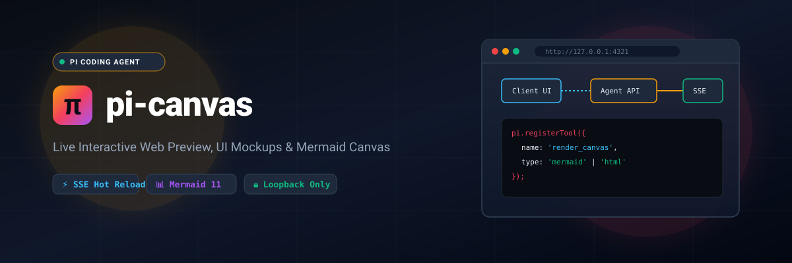

<p align="center">
  
</p>

<p align="center">
  <a href="https://www.npmjs.com/package/pi-canvas"></a>
  <a href="https://github.com/lleontor705/pi-canvas/actions"></a>
  <a href="https://pi.dev"></a>
  <a href="LICENSE"></a>
  <a href="https://nodejs.org"></a>
</p>

---

## 🎨 Overview

**pi-canvas** brings the visual power of Claude Artifacts and v0.dev live UI previews directly to **[Pi Coding Agent](https://pi.dev)** sessions in your terminal.

Pi Agent is minimal by design, but software development is fundamentally visual. `pi-canvas` bridges the gap by spinning up an ultra-lightweight, zero-dependency local loopback web server (`127.0.0.1`) that receives diagrams, prototypes, and vector graphics pushed by the AI agent in real time via Server-Sent Events (SSE).

```
┌──────────────┐          render_canvas          ┌───────────────────────┐
│              │ ──────────────────────────────> │                       │
│   Pi Agent   │                                 │   pi-canvas (127.0.0.1)│
│  (Terminal)  │ <────────────────────────────── │      (SSE Stream)     │
└──────────────┘          user feedback          └───────────┬───────────┘
                                                             │
                                                             ▼
                                                 ┌───────────────────────┐
                                                 │   Browser Artifact    │
                                                 │ (Mermaid / HTML / SVG)│
                                                 └───────────────────────┘
```

---

## ✨ Features

- ⚡ **Live Hot-Reload via SSE:** Instant push updates whenever Pi creates or refines an artifact.
- 📊 **Native Mermaid 11 Diagrams:** Flowcharts, sequence diagrams, class models, and state diagrams.
- 💻 **Interactive HTML/Tailwind Sandbox:** Isolated iframe stage to preview web components, forms, and pages.
- 🖼️ **SVG Inspector:** Vector graphics with dark-mode canvas integration.
- 📜 **Session History Sidebar:** Switch between artifacts generated during your session.
- 🔒 **Loopback Security:** Binds strictly to `127.0.0.1` and rejects external network requests.

---

## 🚀 Installation

### Via Pi Package Registry (Recommended)
```bash
pi install npm:pi-canvas
```

### Direct from GitHub
```bash
pi install git:https://github.com/lleontor705/pi-canvas.git
```

### From Local Clone
```bash
git clone https://github.com/lleontor705/pi-canvas.git
cd pi-canvas
npm install && npm run build
pi install ./
```

---

## 📖 Usage & Commands

### Slash Commands

| Command | Description |
| :--- | :--- |
| `/canvas` | Starts the server (if not already running) and opens your browser. |
| `/canvas stop` | Stops the background loopback HTTP server. |
| `/canvas clear` | Clears all active artifacts from the sidebar. |
| `/preview <path>` | Previews an existing `.html`, `.svg`, `.mmd`, or `.md` file directly. |

### Agent Autonomous Tool (`render_canvas`)

When `pi-canvas` is installed, Pi gains the ability to display visual content autonomously:

```typescript
// Example prompt:
"Design a sequence diagram showing our OAuth2 authentication flow with refresh tokens."
```

Pi will invoke `render_canvas` with:
- `title`: "OAuth2 Auth Flow"
- `type`: "mermaid"
- `content`: Flowchart syntax
- `autoOpen`: `true`

Your default browser automatically opens displaying the rendered diagram with dark mode styling!

---

## 🏗️ Architecture & Development

```bash
# Clone the repository
git clone https://github.com/lleontor705/pi-canvas.git
cd pi-canvas

# Install dependencies
npm install

# Compile TypeScript
npm run build
```

Project Structure:
```
pi-canvas/
├── assets/
│   └── banner.svg         # SVG vector banner
├── dist/                  # Compiled ESM JavaScript & Type definitions
├── skills/
│   └── canvas/SKILL.md    # Pi Agent Skill instructions
├── src/
│   ├── index.ts           # Extension entry point & tool definitions
│   ├── server.ts          # Loopback HTTP + SSE server & embedded web app
│   └── types.ts           # Type definitions
├── .github/workflows/
│   ├── ci.yml             # Build & validation workflow
│   └── release.yml        # Tagged release & npm publish
├── package.json           # Pi manifest declaration
└── tsconfig.json          # TypeScript NodeNext configuration
```

---

## 📄 License

MIT © [Luis Leon](https://github.com/lleontor705)
